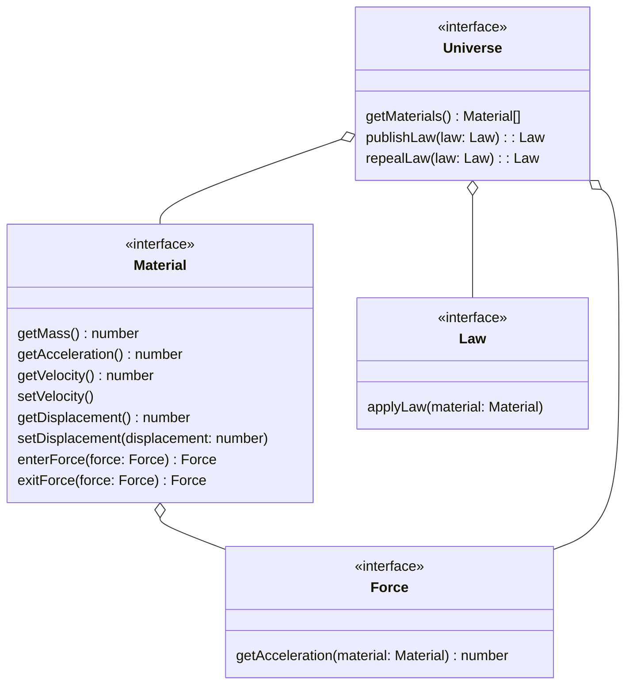

# Architecture

## UML

```mermaid
classDiagram
  Material o-- Force
  Universe o-- Material 
  Universe o-- Law 
  Universe o-- Force 

  class Universe {
    <<interface>>
    getMaterials() Material[]
    publishLaw(law: Law): Law
    repealLaw(law: Law): Law
  }

  class Law {
    <<interface>>
    applyLaw(material: Material)
  }

  class Force {
    <<interface>>
    getAcceleration(material: Material) number
  }

  class Material {
    <<interface>>
    getMass() number
    getAcceleration() number
    getVelocity() number
    setVelocity()
    getDisplacement() number
    setDisplacement(displacement: number)
    enterForce(force: Force) Force 
    exitForce(force: Force) Force
  }
```
