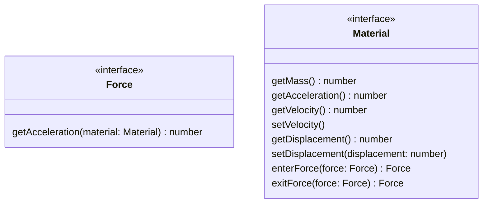

# Architecture

## UML

```mermaid
classDiagram
  class Force {
    <<interface>>
    getAcceleration(material: Material) number
  }
  class Material {
    <<interface>>
    getMass() number
    getAcceleration() number
    getVelocity() number
    setVelocity()
    getDisplacement() number
    setDisplacement(displacement: number)
    enterForce(force: Force) Force 
    exitForce(force: Force) Force
  }
```
